<<<<<<< Updated upstream
# FiadoDigital PDV


=======
# PDV Digital

Sistema de Ponto de Venda (PDV) híbrido e local para pequenos comércios. Controle de vendas, estoque, clientes com crédito, dashboard gerencial e impressão de cupom não fiscal. **Não emite NF-e** — o único comprovante é o cupom/recibo não fiscal impresso.
>>>>>>> Stashed changes

## Descrição do Projeto (O Problema e a Solução)

Muitos pequenos comerciantes (mercearias, mercadinhos e padarias) operam com a concessão de crédito informal aos seus clientes frequentes — o famoso "fiado" no "caderninho". Essa prática, embora fundamental para a fidelização local, frequentemente ocorre sem garantias formais, resultando em desorganização nos recebimentos, atritos no momento da cobrança, alto risco financeiro e inadimplência.

A solução é o **FiadoDigital PDV**, um sistema híbrido de Ponto de Venda projetado especificamente para o pequeno varejo de bairro, de forma local e offline-first. Ele substitui o caderninho por uma gestão inteligente com digitalização do fiado, incluindo mecanismos de gestão de risco como bloqueio automático de inadimplentes, além de facilitar a comunicação via WhatsApp para cobranças e envio de recibos digitais. A plataforma estabiliza o fluxo de caixa enquanto mantém a relação de confiança do lojista com seus clientes.

---

## Screenshots / Demo

| Desktop (1920×1080) | Desktop (1024×768) | Smartphone |
| --- | --- | --- |
| 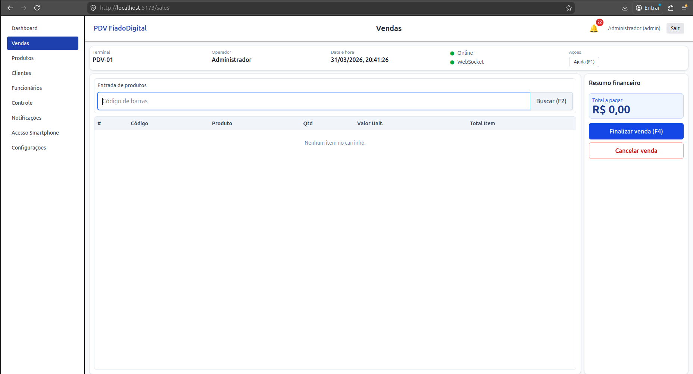 | 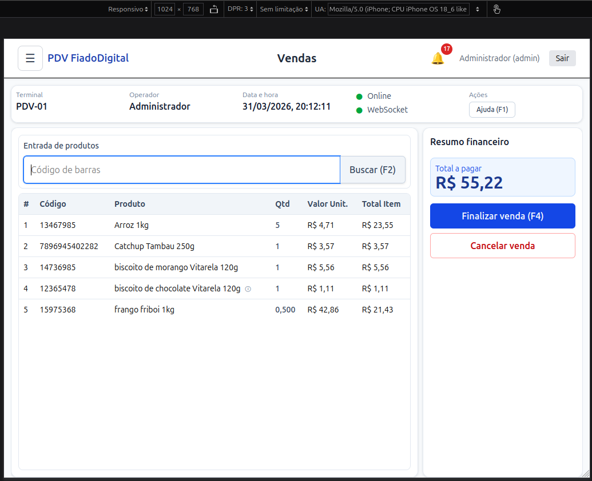 |  |
| 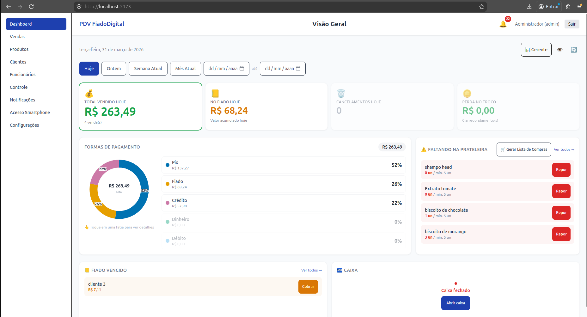 | 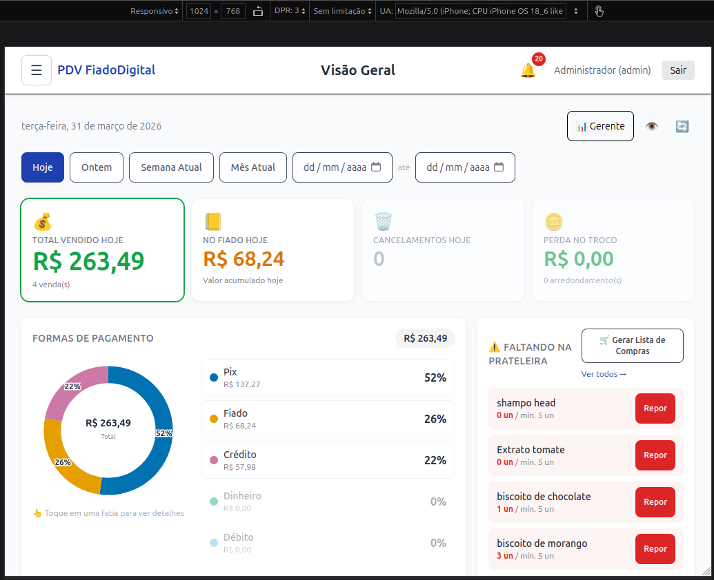 | 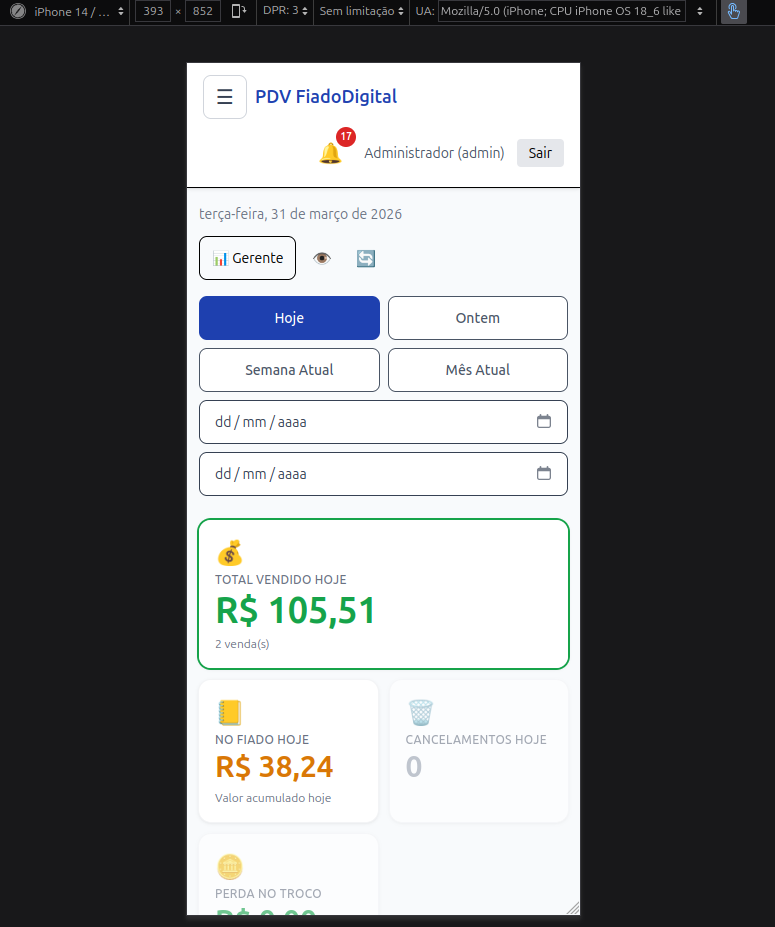 |
| 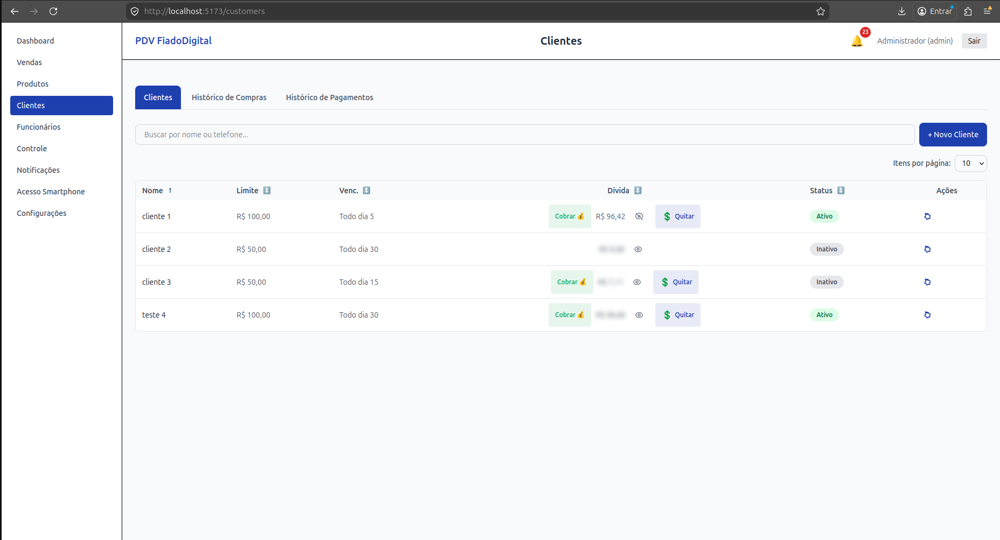 | 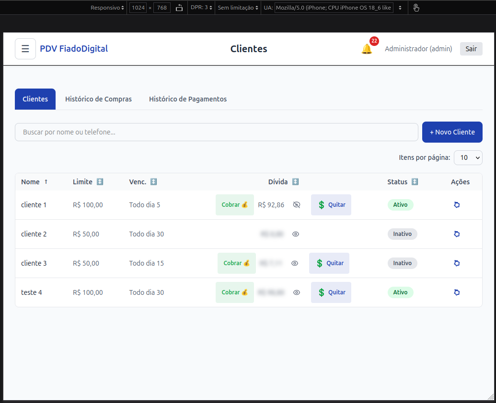 | 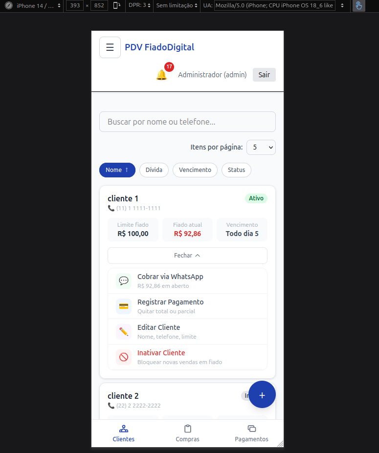 |
| 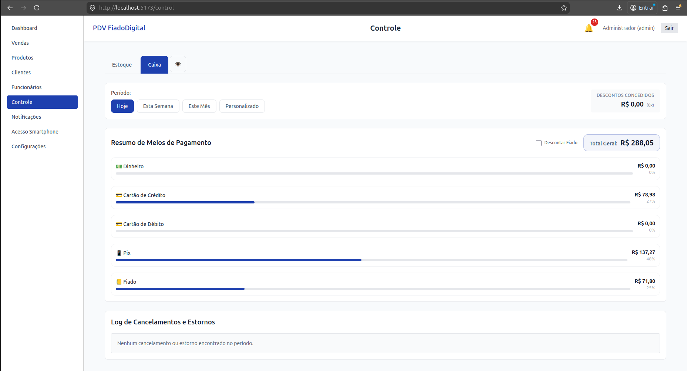 | 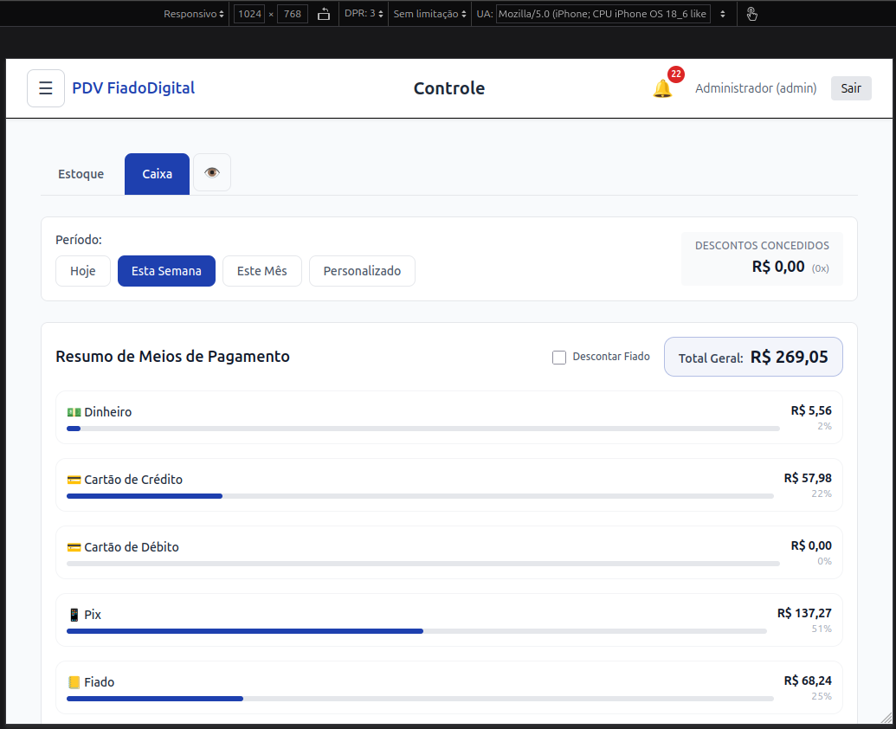 | 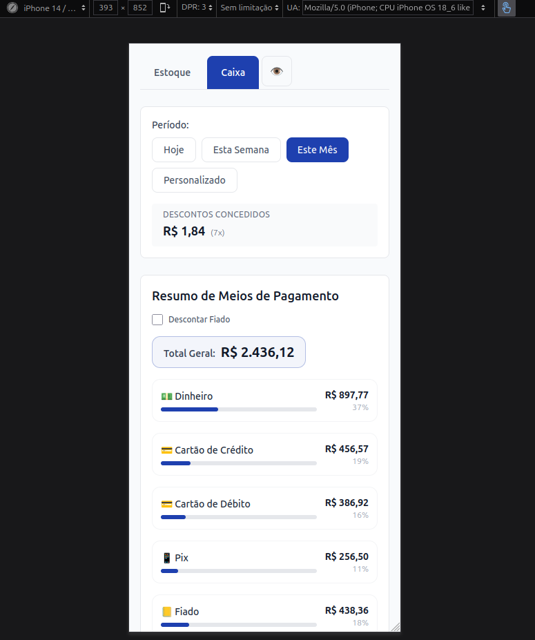 |

---

## Funcionalidades Principais

- 🔐 **Autenticação Obrigatória:** Todas as páginas exigem login com usuário e senha. Nenhuma rota é pública.
- 👥 **Gestão de Clientes ("Caderninho Digital"):** cadastro completo, limite de crédito individual, status inteligente (bloqueio automático de inadimplentes), cobrança via WhatsApp, quitação protegida por PIN de segurança.
- 🛒 **Frente de Caixa:** multimeios de pagamento (até dois meios por venda: dinheiro, PIX, cartão, fiado), cálculo automático de taxas de maquineta, arredondamento de troco configurável.
- 📱 **Acesso Smartphone:** espelhamento via QR Code, gestão de estoque da prateleira, cobrança móvel.
- 📊 **Dashboard e Relatórios:** gráficos de rosca por modalidade de pagamento, alertas de ruptura de estoque, histórico com recibos em PDF, acompanhamento de pagamentos parciais.
- 🔔 **Alertas Inteligentes:** estoque mínimo, sangria de caixa, alerta de fiado ao atingir 90% do limite.
- 💾 **Backup:** manual ou agendado, com criptografia opcional e restauração parcial por módulo.
- 🌐 **Modo Offline:** fila transacional com replay automático e idempotência via `use-offline-queue.ts`.

---

## Arquitetura

### 5.1 Visão Geral

O projeto é construído em um monorepo (`pnpm workspaces`) que abriga três pacotes distintos:

| Pacote | Tecnologia | Responsabilidade |
|---|---|---|
| `@pdv/web` | Vue 3 + Vite + Tailwind CSS v4 | SPA/PWA — interface do operador |
| `@pdv/api` | Node.js 20 + Express 4 + Prisma | HTTP REST + WebSocket — lógica de negócio |
| `@pdv/shared` | TypeScript | Tipos e contratos compartilhados |

### 5.2 Diagrama de Componentes (ASCII)

```text
┌──────────────────────────────────────────────────────┐
│                  PDV FiadoDigital                    │
│                                                      │
│   ┌────────────┐   HTTP/REST    ┌──────────────────┐ │
│   │  apps/web  │ ◄────────────► │    apps/api      │ │
│   │  (Vue/Vite)│   WebSocket    │  (Express +      │ │
│   │            │ ◄────────────► │   Prisma +       │ │
│   └────────────┘                │   SQLite)        │ │
│                                 └────────┬─────────┘ │
│                                          │           │
│                              ┌───────────▼─────────┐ │
│                              │   data/dev.db       │ │
│                              │   (SQLite local)    │ │
│                              └─────────────────────┘ │
│                                                      │
│   Externo: Pix webhook (provedor PSP)                │
│   Externo: Cloud storage (backup opcional)           │
└──────────────────────────────────────────────────────┘
```

### 5.3 Decisões Arquiteturais Chave (ADRs resumidas)

| Decisão Arquitetural | Descrição Base |
|---|---|
| **Persistência Offline-first** | Banco SQLite local operando no modo WAL (Write-Ahead Logging). |
| **Sessão e Identidade** | Baseada em JWT com o refresh token isolado em cookie HttpOnly. |
| **Tempo Real** | Comunicação via WebSocket nativo com fallback de segurança para polling. |
| **Escalabilidade Visual** | O Frontend utiliza lazy loading em suas rotas. |
| **Tolerância Offline** | Fila offline de tipo transacional que preserva mutações. |

---

## Stack Tecnológico Completo

| Camada | Ferramenta / Plataforma |
|---|---|
| **Frontend** | Vue 3, Vite, Tailwind CSS v4, Pinia, vue-virtual-scroller, QRCode |
| **Backend** | Node.js 20.x LTS, Express 4.x, Zod, ws, Rate Limit (express-rate-limit) |
| **Banco de Dados** | SQLite via Prisma ORM (`better-sqlite3`) |
| **Infra/Tooling** | pnpm 8.x+, Docker Compose, GitHub Actions |

---

## Pré-requisitos e Configuração do Ambiente

### 7.1 Requisitos

| Requisito | Versão mínima | Verificação |
|---|---|---|
| Node.js | 20.x LTS | `node --version` |
| pnpm | 8.x | `pnpm --version` |
| SO | Linux, macOS ou Windows (WSL2 recomendado) | — |

### 7.2 Instalação Completa (passo a passo)

```bash
# 1. Clonar o repositório
git clone https://github.com/MoisesVNdev/PDV-FiadoDigital.git
cd PDV-FiadoDigital

# 2. Instalar dependências
pnpm install

# 3. Configurar variáveis de ambiente
cp apps/api/.env.example apps/api/.env
# Edite .env e preencha JWT_SECRET, JWT_REFRESH_SECRET e DATABASE_URL

# 4. Migrar banco e gerar Prisma Client
cd apps/api
pnpm db:migrate
pnpm db:generate
pnpm db:seed

# 5. Iniciar em modo desenvolvimento (via Docker Compose)
cd ../..
docker compose up
```

### 7.3 Credenciais padrão (seed)

Ao executar a migração original, as credenciais para o operador gerencial são:

| Campo | Valor |
|---|---|
| Usuário | `admin` |
| Senha | `admin123` |
| PIN gerencial | `123456` |

> ⚠️ Troque imediatamente em qualquer ambiente não-descartável.

### 7.4 Scripts disponíveis

Existem scripts atalhos no repositório nas instâncias de pacotes.

**Backend (`apps/api`):**
- `pnpm dev` — Roda o Express local integrado com `tsx`.
- `pnpm build` — Geração limpa de bundle do backend via `tsc`.
- `pnpm test` — Validação de testes no framework Vitest.
- `pnpm db:migrate` — Ajusta a base de dados em ambiente de desenvolvimento (`prisma db push`).
- `pnpm db:seed` — Geração dos dados primitivos configuráveis.
- `pnpm db:studio` — Visualizador do banco utilizando as credenciais correntes.

**Frontend (`apps/web`):**
- `pnpm dev` — Subir a instância do Vite na porta correspondente e com proxy preconfigurado.
- `pnpm build` — Cria a árvore estática otimizada de deploy de interface (Vue/PWA).
- `pnpm test` — Suite frontend executando coverage no Vitest.
- `pnpm test:e2e` — Playwright headless check das interações complexas do frontend.

---

## Segurança

- Autenticação e Autorização blindada com JWT em dois fluxos, delegando o armazenamento do refresh token a um cookie HttpOnly (proteção ativa e mitigação plena contra ataques XSS).
- PIN gerencial (fortificado na encriptação de bcrypt + rate limit) parametrizado nas operações de risco de perda financeira ou violação analítica: cancelamento, estorno, quitação de fiado.
- Senha administrativa obrigatória em rotas que expõem alterações críticas, a exemplo da injeção de parâmetros via API (ex: chave PIX das cobranças).
- Controle de políticas unificadas em nível de Headers HTTP e CORS limitado explicitamente a origin local (LAN).
- **Todas as rotas exigem autenticação.** A lógica interna não compreende falhas na permissão de escopos estáticos, invalidando requests em end-points que não representem o `/auth/login` e `/auth/refresh`.
- Processo de estabilização contínua usando backup com opção flexível e adaptativa de criptografia (AES-256-GCM) para armazenar os dados serializados da bateria.

---

## Testes

Cobertura escalada utilizando as principais ferramentas do segmento Node.js e SPA Client.

| Camada | Framework | Cobertura |
|---|---|---|
| Unitários (frontend) | Vitest + jsdom | 100% nos composables de domínio e interface |
| E2E (frontend) | Playwright (Chromium) | Suítes de fumaça: Venda, Cancelamento, Caixa, Fiado, Notificações |
| Unitários (backend) | Vitest | Suíte local focada nos repositórios, serviços transacionais críticos e controladores base. Coverage habilitado nas métricas V8. |

Scripts rápidos de bateria autônoma em teste CI:

```bash
# Frontend
pnpm --filter @pdv/web test
pnpm --filter @pdv/web test:e2e

# Backend
pnpm --filter @pdv/api test
```

---

## CI/CD

- Existe provisionamento dinâmico via pipeline do **GitHub Actions** (`.github/workflows/ci.yml`).
- A branch de base analítica é a primária: `main`. A estratégia de resiliência e controle na formatação consiste obrigatoriamente no modo de merge tipo: **Squash**.
- A esteira engloba o roteiro serial rigoroso das etapas cruciais: **lint → type-check → testes unitários → build**.
- Subida aos ambientes ou o deploy final em produção do aplicativo se traduz em wrapper interativo via **Tauri** (operando estritamente em modo kiosk). *Este empacotador de sistema de interface base constitui-se em um repositório isolado e apartado, ficando portanto fora do escopo deste monorepo.*

---

## Variáveis de Ambiente

As configurações sensíveis ficam encapsuladas de forma central, com definições expostas que regulam a lógica ou conexão da infraestrutura local sem violar os hard-code sources.

| Variável | Obrigatória | Descrição |
|---|---|---|
| `JWT_SECRET` | ✅ | Chave de assinatura dos access tokens |
| `JWT_REFRESH_SECRET` | ✅ | Chave de assinatura dos refresh tokens |
| `DATABASE_URL` | ✅ | Caminho do arquivo SQLite (`file:./data/dev.db`) |
| `NODE_ENV` | ✅ | Define as métricas e optimizações contextuais (`development` / `production`) |
| `CORS_ORIGIN` | ✅ | Proteção origin da plataforma de request (ex: `http://localhost:5173`) |
| `PORT` | - | Porta global de operação |
| `APP_TIME_ZONE` | - | Formatação universal restrita no backend |
| `PIX_KEY_TYPE` | - | Configuração do Pix |
| `PIX_KEY` | - | Referência do pix do comércio |
| `VITE_API_URL` | ✅ | URL resolvida pelo roteador Vue via proxy local, no path do workspace Frontend (`@pdv/web`). |
| `VITE_WS_URL` | ✅ | Conector das instâncias e canais locais dos WebSockets no Frontend (`@pdv/web`). |

---

## Estrutura do Monorepo

O workspace localiza sua construção nos seguintes agrupadores primários (altíssimo nível estrutural):

- `apps/api`
- `apps/web`
- `packages/shared`
- `prisma/`
- `.github/`
- `docs/`

---

## Contribuindo

Temos padronização para integrar atualizações que regem um projeto saudável:

- [Guia de Contribuição](.github/CONTRIBUTING.md) — `.github/CONTRIBUTING.md`
- [Template de Pull Request](.github/PULL_REQUEST_TEMPLATE.md) — `.github/PULL_REQUEST_TEMPLATE.md`
- Templates de issues listados na ramificação `.github/ISSUE_TEMPLATE/`
- Instruções estruturais para interações orgânicas orientadas usando Inteligência Artificial estão organizadas no catálogo em `.github/copilot-instructions.md`.

---

## Roadmap e Dívida Técnica

Manutenções profundas, monitoramento e métricas analíticas de pendência e restabelecimento constam formalizados e orientados dentro da plataforma corporativa sob o documento central: `docs/info-projeto/resumo-infraestrutura-projeto.md` (no subgrupo logístico pertencente à sua referida "Seção 17"). A pendência avaliada abertamente em estágio mais recente diz respeito à demanda interna de escalação:  **P17.21**.

---

## Autor e Licença

- Autor: [Moisés Vila Nova De Oliveira](https://github.com/MoisesVNdev/MoisesVNdev) — moisesvn.dev@gmail.com
- Licença: Projeto base encontra-se disponibilizado sob os ditames estruturais abertos [MIT](https://opensource.org/license/mit).